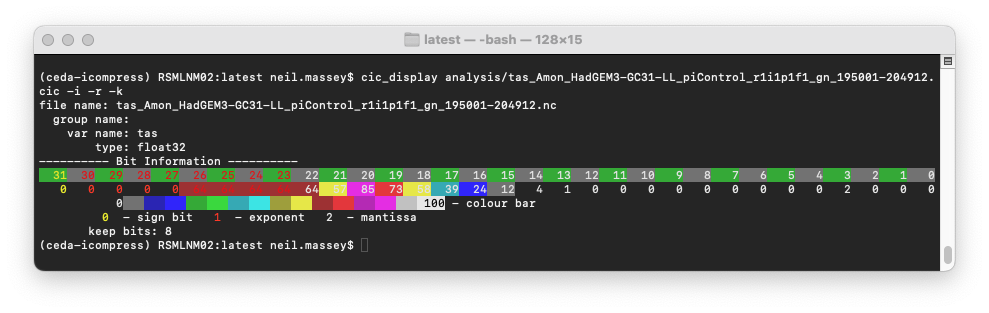

# ceda-icompress

## Introduction

**ceda-icompress** is a library and command line client to apply lossy 
compression to netCDF files, by rounding bits and applying run length encoding 
directly to the netCDF data.
This can result in a much smaller file, that can still be read by standard
netCDF tools.

**ceda-icompress** is essentially a pure-Python implementation of the ideas
contained in the *Klöwer et al., 2021*<sup>**1**</sup> paper.  Some of the 
implementation details are different, but the results have been checked and are 
bitwise compatible with those gained by using the *bitinformation.jl* Julia 
library linked in *Klöwer et al., 2021*<sup>**2**</sup>.

The idea of applying bit manipulations to climate model data, before applying
compression, is not new, as seen in the *Zender, 2016*<sup>**3**</sup> paper.
However, the novel approach of *Klöwer et al., 2021* is to use Shannon 
Information Theory to determine at which significant-bit there is no longer any
information in the data.  Any bits less significant than this bit are essentially
encoding noise, and can be masked.

## Installation ##

**ceda-icompress** requires Python 3.10+.  It can be installed directly from
the GitHub repository.  However, users may wish to set up a Python virtual
environment first, and this is the recommended way to install **ceda-icompress**.

```
>>> python3 -m venv ceda-icompress
>>> source ceda-icompress/bin/activate
>>> pip install git+https://github.com/nmassey001/ceda-icompress
```

## Instructions ##

After installation, **ceda-icompress** makes three commands available on the
command line:

1. `cic_analyse` this applies the methods from *Klöwer et al., 2021* to a netCDF
file to derive the *bitinformation* for the variable(s) in the file.  It will
output the *bitformation* in a JSON format file.
2. `cic_display` this displays the *bitinformation* from the JSON file.
3. `cic_compress` this applies lossy compression to a netCDF file, based on the
*bitinformation* in the JSON file.

A typical workflow will involve:

1.  Apply `cic_analyse` to a netCDF file, obtain the JSON file.
2.  (Optional) inspect the `bitinformation` in the JSON file using `cic_display`
3.  Apply `cic_compress` to the same netCDF file, using the JSON file as the *bitinformation* file.

Splitting the analysis and compression into two separate processes allows the
same analysis to be used to compress a number of netCDF files.  For example,
if there are a number of files in a timeseries of the same variable, the 
analysis can be performed on the first (or middle) file in the timeseries, and
the analysis used to compress each file in the timeseries.

## Command reference ##

### cic_analyse

```
Usage: cic_analyse [OPTIONS] FILE

  Analyse the netCDF file to determine compression settings.

Options:
  -v, --var TEXT        Variable in netCDF file to analyse
  -g, --group TEXT      Group in netCDF file to analyse
  -x, --axis INTEGER    Axis number to analyse
  -o, --output TEXT     Output file name
  -D, --debug           Provide debug info
  --help                Show this message and exit.
Options (experimental, may be removed in future versions):
  -t, --tstart INTEGER  Timestep to start analysis at
  -e, --tend INTEGER    Timestep to end analysis at
  -l, --level INTEGER   Level number to analyse
```

**Notes**
1. The `--var` option can be used to analyse just one variable.  This is useful
if you don't want to analyse the co-ordinate variables in a netCDF file, for
example.
2. The `--group` option is similar - it can be used to analyse just one group.
3. The `--axis` option is very important and can greatly affect the compression
acheived.  For most atmospheric flow, the `longitude` dimension should be
chosen.  In CMIP6, this is either the `2` axis (for surface variables) or the 
`3` axis (for variables with levels).

### cic_display

```
Usage: cic_display [OPTIONS] ANALYSIS_FILE

  Display the analysis output of cic_analyse.py

Options:
  -v, --var TEXT    Variable to display from analysis file
  -g, --group TEXT  Group to display from analysis file
  -i, --info        Display bit information
  -k, --keepbits    Display number of bits to keep
  -c, --ci FLOAT    Confidence interval for keep bits (default=0.99)
  -r, --reverse     Reverse bit positions in display
  --help            Show this message and exit.
```

**Notes**

1. `cic_display` provides a nice, old school, ASCII representation of the 
*bit information*:

2. Here the *bit information* has been scaled to be between 0 and 100.  In 
reality, it is between 0 and 1.
3. Using the `--reverse` option puts the sign bit first, followed by the 
exponent, then the mantissa.  This is actually the opposite way that the IEEE
floating point standard stores a float, but it is often the way it is depicted
in tutorials, books, etc.

### cic_compress

```
Usage: cic_compress [OPTIONS] FILE

  Apply the compression to a netCDF using the analysis derived earlier

Options:
  -a, --analysis_file TEXT  Analysis file generated from cic_analyse
  -d, --deflate INTEGER     Deflate (compression) level to use when writing
                            file
  -f, --force               Force compression of file, even if input file does
                            not match the file named in the analysis
  -c, --ci FLOAT            The confidence interval - how much information to
                            retain. default = 0.99 (99%)
  -I, --conv_int            Convert 64 bit integers to 32 bit integers
  -F, --conv_float          Convert 64 bit floats to 32 bit floats
  -m, --method TEXT         Method to use for bit manipulation: bitshave |
                            bitgroom | bitset | bitmask
  -o, --output TEXT         Output file name
  -D, --debug               Provide debug info
  --help                    Show this message and exit.
Options (experimental, may be removed in future versions):
  -P, --pchunk INTEGER      Number of timesteps to process per iteration
```

**Notes**

1.  The `--deflate` option determines how much compression the netCDF library
will apply to the file after the bit manipulation has complete.  This value
can range from 0 to 9.
2.  The `--force` option is required if an analysis file derived from one netCDF
file is to be used to compress a different netCDF file.  Without the `--force`
option, `cic_compress` will produce an error in this case.
3.  Analysis for variables cannot be used on variables with different names.
4.  An analysis file can contain analyses for several variables and these will
be used to compress the variables in the netCDF file, if the variable name 
matches.
5.  How the confidence interval affects the setting of bits is described in the
methods section of *Klöwer et al., 2021*.  The range is from 0.0 to 1.0, and the
higher the confidence interval, the more information will be retained as fewer
bits will be set to zero.
6.  The `--conv_int` will convert any 64 bit integers to 32 bit but will not 
apply the bit manipulation to them.  This is useful if (for example) co-ordinate
variables are 64 bit integers.  The range of a 64 bit integer is not usually 
required in climate data.
7.  The `--conv_float` will convert any 64 bit floating point numbers to 32 bits
and will not apply any bit manipulation.  Again, this is useful if co-ordinate
variables are 64 bit floats.  The accuracy and range of a 64 bit floating point
number is not usually required in climate data.
8.  The `--method` determines what bit manipulation to perform on the data.  
These are explained in *Klöwer et al., 2021* and *Zender, 2016*.
9.  The `bitmask` method is new for **ceda-icompress**.  `bitshave` determines
where the cumulative bit information is below a confidence interval, and sets
bits below that to zero. Instead, `bitmask` examines the information of each bit
in turn and sets it to zero if the information is deemed to be insignificant.
This should reduce errors by allowing the lower bits to still influence the
outcome, but it is an experimental feature.

## Example ##

Here is a quick example on JASMIN for CMIP6 data, showing the workflow.

```
DIR=/badc/cmip6/data/CMIP6/CMIP/MOHC/HadGEM3-GC31-LL/piControl/r1i1p1f1/Amon/tas/gn/latest
cic_analyse $DIR/tas_Amon_HadGEM3-GC31-LL_piControl_r1i1p1f1_gn_195001-204912.nc -o analysis/tas_Amon_HadGEM3-GC31-LL_piControl_r1i1p1f1_gn_195001-204912.cic -v tas -x 2 -D
cic_display analysis/tas_Amon_HadGEM3-GC31-LL_piControl_r1i1p1f1_gn_195001-204912.cic -r -i -k
cic_compress $DIR/tas_Amon_HadGEM3-GC31-LL_piControl_r1i1p1f1_gn_195001-204912.nc  -o compressed/tas_Amon_HadGEM3-GC31-LL_piControl_r1i1p1f1_gn_195001-204912_comp.nc -a analysis/tas_Amon_HadGEM3-GC31-LL_piControl_r1i1p1f1_gn_195001-204912.cic -d 5 -c 0.99 -I -F -m bitshave -D
```

In this case the reduction of the file size is from 68MB to 12MB

## Why icompress? ##

The name of the module is not an attempt to channel early Y2K Apple product 
names and marketing.  Instead it reflects that the compression algorithm 
converts floating point numbers to (unsigned) integers, then uses bitmasks to 
manipulate the integers, before casting the number back to its original floating
point form.

## References and links ##
1. **Klöwer, M., Razinger, M., Dominguez, J.J. *et al.*** Compressing atmospheric 
data into its real information content. *Nat Comput Sci* **1**, 713–724 (2021).
[https://doi.org/10.1038/s43588-021-00156-2](https://doi.org/10.1038/s43588-021-00156-2)
2. **Bitinformation.jl GitHub repository**. [https://github.com/milankl/BitInformation.jl](https://github.com/milankl/BitInformation.jl)
3. **Zender, C. S.** Bit Grooming: statistically accurate precision-preserving quantization with compression, evaluated in the netCDF Operators (NCO, v4.4.8+).
*Geoscientific Model Development* **9**, 3199--3211 (2016).
[https://gmd.copernicus.org/articles/9/3199/2016/](https://gmd.copernicus.org/articles/9/3199/2016/)